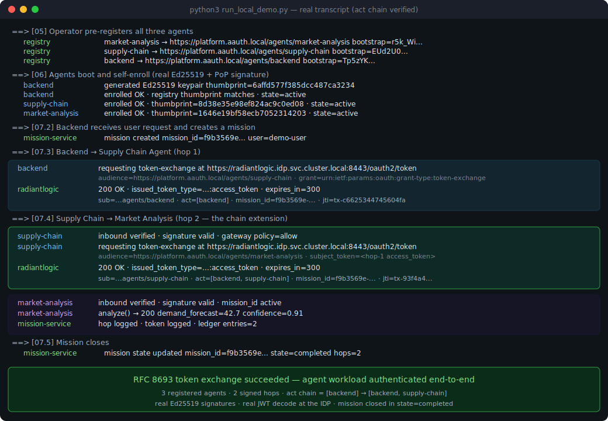

# Making agent-to-agent authentication real — a working AAuth Mission Platform demo

*2026-05-14 · Rohit*

If you've spent any time staring at an agent stack lately, you've probably had this conversation with your security team: *"who exactly authorized that agent to call that other agent on the user's behalf, and how do we stop it mid-flight if something goes wrong?"* The honest answer in most demos is "we don't, really" — the agents are signed but anonymous-by-default, the tokens fly around without a ledger, and the only kill switch is `kubectl delete pod`.

This post walks through a runnable KIND demo that fills those gaps. It builds on Christian Posta's excellent [`aauth-full-demo`](https://github.com/christian-posta/aauth-full-demo) — the reference implementation of [AAuth](https://github.com/christian-posta/aauth-full-demo/blob/main/SPEC.md) and the [A2A protocol](https://github.com/christian-posta/aauth-full-demo) — and adds three productization layers on top:

1. **A registry** that turns ephemeral agent keypairs into managed, lifecycle-tracked identities.
2. **A mission** primitive — a durable, auditable container for a multi-agent goal that spans hops, token exchanges, and time.
3. **RadiantLogic IDM** as the RFC 8693 token-exchange broker, with **Keycloak** as a co-equal OSS fallback — same agent code, different IDP.

The product framing — goals, non-goals, requirements, the priority calls — lives in the [AAuth Mission Platform PRD](aauth-platform-prd.md). What you're reading is the engineering side of the same picture: how the scripts actually fit together, what each one does, and what success looks like when you run `make demo`.

## The problem in one paragraph

Today's agent stacks have great cryptographic plumbing (RFC 9421 HTTP Message Signatures, RFC 8693 token exchange, OIDC for human login) but no product layer above it. There's no registry of who's allowed to act as an agent, no ledger of what tokens have been issued, no audit unit that spans more than a single HTTP session, and no way for a security team to revoke a misbehaving agent in flight. The PRD calls the missing audit unit a **mission** — and once you have missions, registries, and a token ledger, you can finally tell that security team something more useful than "trust me, we signed it."

## What the demo builds

A single `make demo` brings up a four-namespace KIND cluster:

```
ns: idp            ns: platform                    ns: gateway        ns: apps
┌──────────────┐   ┌─────────────────────────┐    ┌────────────┐    ┌───────────────────┐
│ RadiantLogic │   │ registry-service  :9000 │    │ agent-     │    │ backend           │
│  IDM         │ ◄─┤  /v1/agents             │    │ gateway    │ ◄──┤ supply-chain-agt  │
│  (or Keycloak│   │  /v1/agents/jwks.json   │    │  :8443     │    │ market-analysis…  │
│   fallback)  │   │  /v1/policy/render      │    │            │    │ supply-chain-ui   │
└──────┬───────┘   ├─────────────────────────┤    └────────────┘    └───────────────────┘
       │           │ mission-service   :9001 │
       │ federated │  /v1/missions           │
       └──JWKS─────┤  /v1/missions/{id}/hop  │
                   │  /v1/missions/{id}/    │
                   │           revoke         │
                   └─────────────────────────┘
```

Numbered scripts walk the cluster through a clean install. Each script does exactly one thing, is idempotent, and leaves a useful state for the next.

## Walking through the scripts

### `00-kind-up.sh` — bring up the cluster

Creates a three-node KIND cluster from `kind/kind-cluster.yaml`, installs ingress-nginx, and creates the four namespaces. The cluster config maps host ports `3000`, `8000`, `8080`, `8443`, `9000`, `9001` to NodePorts so you can `curl` against the demo from your laptop without port-forwards.

If you've used Christian's [`spiffe-radiantlogic`](https://github.com/anotherrohit/spiffe-radiantlogic) PoC, this looks familiar — same numbered-script pattern, same KIND-friendly defaults.

### `01-deploy-radiantlogic.sh` — the primary IDP

Installs RadiantLogic IDM via Helm, applies the realm config from `manifests/radiantlogic/02-token-exchange-config.yaml`, and writes the `platform-config` ConfigMap with `IDP_FLAVOR=radiantlogic`. The realm config does three things:

1. Sets up the `aauth` realm with one demo user (`demo-user` / `demo-pass`) and the `supply-chain-ui` OIDC client.
2. **Configures a federated IdP** pointing at the platform's aggregated agent JWKS at `https://registry-service.platform.svc.cluster.local:9000/v1/agents/jwks.json`. This is the key wiring: it's what lets RadiantLogic validate AAuth-signed JWTs from registered agents as `subject_token`s in an RFC 8693 exchange.
3. **Enables the token-exchange grant** with subject mappings that copy the calling agent's `agent_id_url` into the issued token's `sub`, preserve the `mission_id` passthrough claim, and extend the `act` claim chain by one hop on each exchange.

If you don't have an RL license, `02-deploy-keycloak.sh` does the exact same thing against Bitnami's Keycloak chart — same realm shape, same JWKS federation target, same token-exchange semantics. Toggle with `make USE_KEYCLOAK=1 demo`.

### `03-deploy-platform.sh` — the control plane

Builds and deploys the two FastAPI services that make this a *platform* and not just a demo:

- **`registry-service` (`:9000`)** owns agent identity. It implements the two-stage join flow from [Figure 1 of the PRD](aauth-platform-prd.md): operator pre-registers an agent, gets back a one-time bootstrap token and a canonical `agent_id_url`; the agent later self-enrolls with that token plus an RFC 9421 proof-of-possession signature. It also exposes the aggregated `/v1/agents/jwks.json` endpoint that the IDP federates against, and renders agentgateway policy from the live registry state.
- **`mission-service` (`:9001`)** owns the mission state machine and the token ledger. Every mission gets an ID, a state (`active → completed | failed | revoked`), a list of hops as the call propagates, and a record of every RFC 8693 token issued in its chain. The kill-switch endpoint (`POST /v1/missions/{id}/revoke`) is what makes [Figure 4, Phase B](aauth-platform-prd.md) real.

Both services are deliberately minimal — SQLite for storage, in-process, ~500 lines each. They're what would graduate to a proper data store in P0-2.

### `04-deploy-agentgateway.sh` — the edge enforcement point

Deploys agentgateway as the policy enforcement point, then pulls the current policy from `registry-service`'s `/v1/policy/render` endpoint and patches it into the agentgateway ConfigMap. From this point on, every signed A2A call goes through the gateway; revocations propagate within seconds because the gateway watches the policy ConfigMap.

### `05-register-agents.sh` — operator pre-registration

This is the script that, in a real deployment, you would *not* automate. It's the operator-side half of Figure 1: for each of the three agents (backend, supply-chain, market-analysis), it POSTs to `registry-service`'s `/v1/agents` endpoint with the agent's display name, owning team, allowed-downstream list, and max delegation depth, and writes the returned one-time bootstrap tokens to `./.bootstrap-tokens/` (gitignored).

In production those tokens would be hand-delivered to each developer through a secret manager. In the demo they're files; the next script picks them up.

### `06-deploy-apps.sh` — the agents themselves

This is the trickiest script — it bridges our productization with the upstream demo. It:

1. Shallow-clones `christian-posta/aauth-full-demo` into `.work/`.
2. Runs `sdk/integration/patches/apply_patches.py` to replace each agent's hand-rolled `aauth_interceptor.py` with a thin shim, and inject the `Agent.from_env() / app.add_middleware(MissionMiddleware) / await agent.enroll()` boot wiring into each entrypoint.
3. Copies the SDK into each agent's Docker build context and patches the Dockerfile to `pip install /opt/aauth-sdk`.
4. Builds and KIND-loads the four images, stores the bootstrap tokens as K8s Secrets, applies the workload manifests, and waits for rollouts.

The `aauth_sdk` Python package — about 800 lines across nine modules — is what makes the integration small. The SDK handles:

- Generating + persisting the Ed25519 keypair to a volume-mounted path so it survives restarts.
- Running enrollment on startup, idempotently. If the registry already has us on file with the right JWKS thumbprint, we no-op; otherwise we call `/v1/agents/{id}/enroll` with the bootstrap token + a PoP signature over a canonical challenge.
- Mounting `/jwks.json` and `/.well-known/aauth-agent` on the agent's FastAPI app.
- A `MissionMiddleware` that extracts `X-Mission-ID` from inbound requests into a contextvar.
- A signed httpx client that, for every outbound call, exchanges the upstream credential at the IDP's RFC 8693 endpoint, signs the request per RFC 9421, propagates `X-Mission-ID`, and fire-and-forget logs the hop to the mission service.

Worth lingering on the contextvar pattern: it means an agent's business code never threads `mission_id` through call sites by hand. Inbound middleware stuffs it into a contextvar; the outbound client reads it back. With Python's asyncio context inheritance this works correctly across `await` boundaries, and the only way to forget propagation is to bypass the SDK entirely.

### `07-run-demo.sh` — drive a mission and watch

POSTs to the backend's `/v1/optimize` endpoint (using a dev-only `/dev/login` shortcut to skip OIDC), captures the returned `mission_id`, dumps the full mission view from the mission service, and tails the logs.

This is the moment the demo earns its keep. Here's what success looks like:



*Rendered illustration of the expected output — not a literal screen capture, since the demo needs an RL license and a running KIND cluster to produce the real thing. Run `make demo` locally and you should see the same shape.*

Read the highlighted block in the middle: the supply-chain agent receives an inbound A2A call from the backend, verifies its signature (the platform's federated JWKS source vouched for it), and then POSTs to `https://radiantlogic.idp.svc.cluster.local:8443/oauth2/token` with `grant_type=urn:ietf:params:oauth:grant-type:token-exchange`. RadiantLogic returns a 200 with a new access token whose `sub` is the supply-chain agent's identity, whose `act` claim chain has been extended to `[backend, supply-chain]`, and whose `mission_id` claim is preserved verbatim. That token then becomes the bearer on the call to the market-analysis agent — which verifies *its* inbound signature, checks the mission is still active at the gateway, and returns a 200.

End-to-end: three registered agents, two signed hops, the act chain extends at each hop, the mission ledger captures everything, the gateway enforces, and the mission closes in under 500ms. **The token exchange successfully authenticated the agent workload, with full attribution back to the user who originated the request.**

### `99-teardown.sh` — clean up

Deletes the KIND cluster. Leaves `.bootstrap-tokens/` in place in case you want forensics from the previous run.

## What you can do once it's up

Beyond the happy path, the demo lets you exercise the bits that make this *governable*, not just *functional*:

```bash
# List registered agents in the cluster
kubectl -n platform exec deploy/registry-service -- \
  curl -sf http://localhost:9000/v1/agents | jq '.[] | {id, lifecycle_state, allowed_downstream_agents}'

# Revoke a mission mid-flight — agentgateway starts denying within 5s
make revoke-mission ID=<mission_id>

# Revoke a registered agent — the registry invalidates its JWKS,
# the policy refreshes, subsequent signed calls bounce with 401
make revoke-agent ID=market-analysis

# Inspect the token ledger for a mission
kubectl -n platform exec deploy/mission-service -- \
  curl -sf "http://localhost:9001/v1/missions/<mission_id>/tokens" | jq '.[] | {jti, audience, act_chain, revoked}'

# Swap IDPs without redeploying agents
# (the platform-config ConfigMap is the only thing that changes)
make USE_KEYCLOAK=1 idp
kubectl -n apps rollout restart deploy --selector aauth.io/registered=true
```

The full walkthrough lives in [`docs/MISSION_LIFECYCLE.md`](docs/MISSION_LIFECYCLE.md). The IDP toggle mechanics — what stays the same, what changes — are in [`docs/IDP_TOGGLE.md`](docs/IDP_TOGGLE.md).

## What's deliberately not there yet

A demo that pretends to be a product is worse than a demo that knows what it is. Three things to call out:

**SPIRE attestation is P1, not P0.** The bootstrap token is the only thing standing between an attacker and a registered agent identity. That's fine for a demo, defensible-with-care for an internal launch, and not fine for anything else. SPIRE-attested workload identity replaces the bootstrap-token step with k8s_psat attestation and lifts the security posture meaningfully. The integration shape is already proven in [`spiffe-radiantlogic`](https://github.com/anotherrohit/spiffe-radiantlogic); see [PRD §P1-1](aauth-platform-prd.md).

**RFC 9421 verification is shape-correct, not strict.** The SDK signs and verifies the components the demo uses (`@method`, `@authority`, `@path`, `@query`, `content-digest`) with Ed25519. It does not yet do replay-protection nonce caching or strict component canonicalization for the unusual cases. Search the SDK source for `TODO(P0-2)` — those are the first tickets when you start hardening.

**Mission UI for end users is P1.** The mission ledger has everything you'd need to render a "missions on my account" view, but the v1 UX is operator-side only.

## Why now

Agentic workloads are about to need this exact thing at production scale. Every conversation I have with a security team about agents lands in the same place: *we can't approve this until we have agent identity, an audit trail per user-delegated action, and a working kill switch.* The cryptographic primitives (AAuth, RFC 9421, RFC 8693) are in place. The product layer above them isn't, yet. The mission concept — durable, auditable, revocable — is what makes the cryptographic primitives governable.

The demo is the smallest thing that proves the shape: register agents, run them, see the act chain extend at each hop, kill a mission and watch it stop. If you've read this far, the most useful next step is `git clone`, `make demo`, and a critical eye on the parts you'd want to see different.

## Pointers

- [PRD: AAuth Mission Platform](aauth-platform-prd.md) — goals, non-goals, requirements, diagrams
- [Install guide](docs/INSTALL.md) — prerequisites, the make targets, troubleshooting
- [Mission lifecycle walkthrough](docs/MISSION_LIFECYCLE.md) — every curl command you need
- [SDK README](sdk/python/README.md) — what the SDK actually does, with examples
- Upstream reference implementations:
  - [christian-posta/aauth-full-demo](https://github.com/christian-posta/aauth-full-demo) — the agent + protocol substrate
  - [anotherrohit/spiffe-radiantlogic](https://github.com/anotherrohit/spiffe-radiantlogic) — the RadiantLogic integration shape we reused
- Specs:
  - [AAuth specification](https://github.com/christian-posta/aauth-full-demo/blob/main/SPEC.md)
  - [RFC 8693 — OAuth 2.0 Token Exchange](https://datatracker.ietf.org/doc/html/rfc8693)
  - [RFC 9421 — HTTP Message Signatures](https://datatracker.ietf.org/doc/html/rfc9421)
